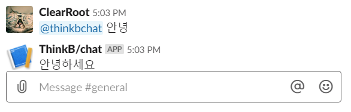
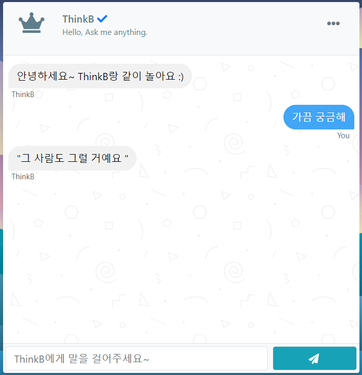

# Sub PJT 3. 딥 러닝 모델을 이용한 챗봇 구현

텍스트 전 처리 기법과 머신러닝 기법을 응용하여 딥 러닝 기반의 챗봇을 구현

팀원: 조호근, 김훈, 양시영, 안현상, 김초희, 이지선

프로젝트 기간:  2019/09/09 ~ 2019/09/26

## 목표

- 질문과 대답으로 이루어진 데이터를 읽고 트레이닝 데이터와 테스트 데이터로 저장하기
- Noise Canceling, Tokenizing 하기
- token 사전 vocabularyData.voc 파일 만들기
- 인코딩, 디코딩용 함수 만들기
- Seq2seq 모델을 이용해 학습하기
- predict.py를 구현하여 새로운 질문에 대답 데이터 출력하기
- Python Slack Client를 사용하여 Flask 서버 app.py 구현하기
- Chatbot과 대화할 용도의 Web을 Flask 서버로 구현하기

## Learming Data

| Title       | Contents                                          |
| ----------- | ------------------------------------------------- |
| 데이터 이름 | Chatbot data                                      |
| 데이터 용도 | 한국어 챗봇 학습을 목적으로 사용한다.             |
| 데이터 권한 | MIT 라이센스                                      |
| 데이터 출처 | https://github.com/songys/Chatbot_data (송영숙님) |

### WordCloud

-  Question Data

- Answer Data

## Requirement

Python==3.7.4

Flask==0.12.2

konlpy==0.5.1

matplotlib==3.1.1

numpy==1.16.3

openpyxl==2.6.3

pandas==0.24.2

scikit-learn==0.20.3

scipy==1.2.1

slackclient==2.1.0

slackeventsapi==2.1.0

tensorboard==1.14.0

tensorflow-estimator==1.14.0

tensorflow-gpu==1.14.0

tqdm==4.36.0

wordcloud==1.5.0

xlrd==1.2.0

## Directory Structure

| Base 프로젝트                                                | 설명                                                         |
| ------------------------------------------------------------ | ------------------------------------------------------------ |
| Data_in/     chatbotdata.csv Data_out/     vocabularyData.voc check_point Configs.py Data.py Main.py Model.py Predict.py app.py db_init.py app.db | - 트레이닝 데이터 영역 - 트레이닝 데이터 파일 - 출력 데이터 영역 - 단어 사전 파일 - 학습된 모델의 check_point 저장 공간 - 모델 설정 소스 - 전 처리 및 모델에 주입되는 데이터셋 구성 - 학습을 실행하는 소스 - tensorflow seq2seq 모델 소스 - 학습된 모델로 예측하는 소스 - Flask 서버 소스 - app.db 파일을 생성하는 소스 - SQLite로 생성된 db 파일 |

## Execution Result

- Slack

- Web

